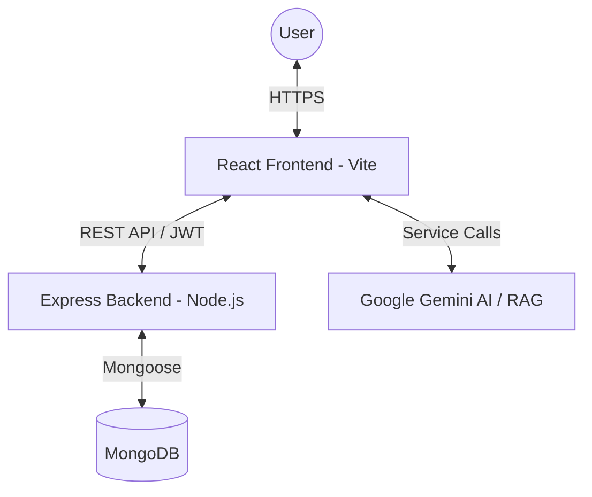
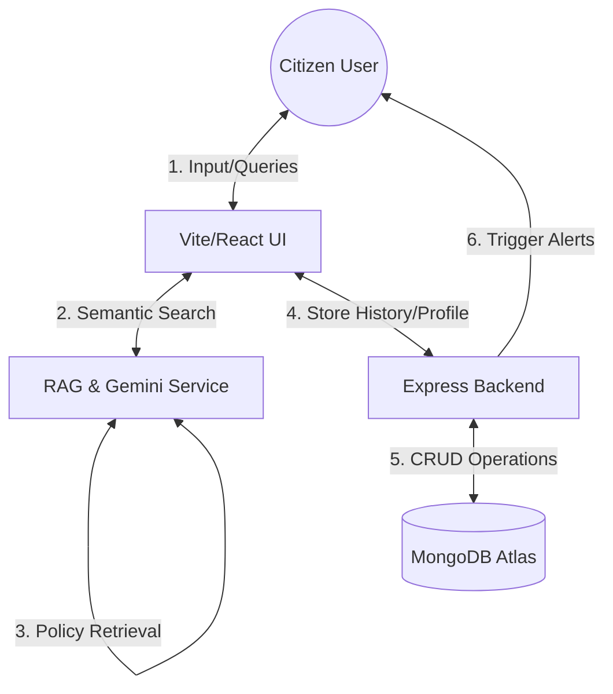
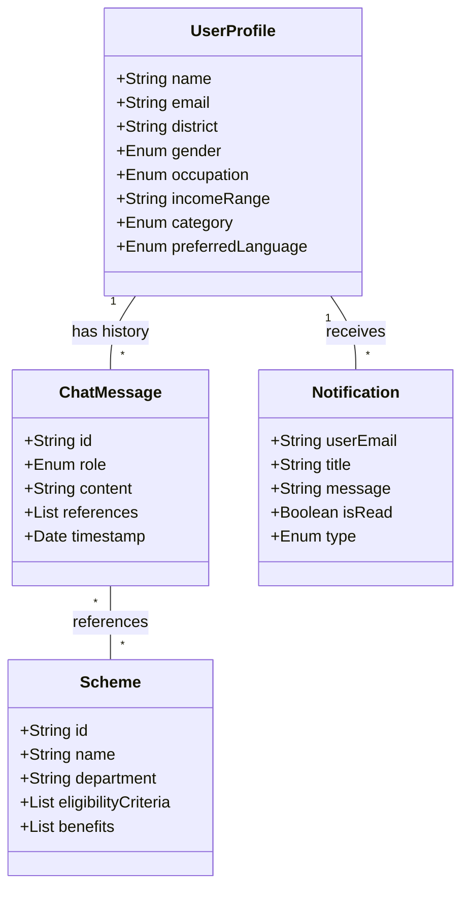
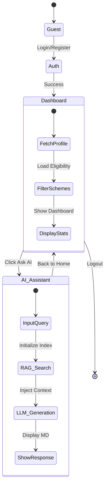
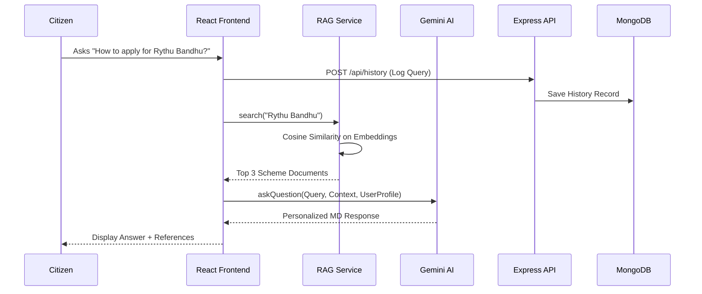

# AI-POWERED CIVIC ASSISTANT FOR STATE GOVERNMENT POLICIES: Government Policy Assistant - Project Report

## 1. Abstract
AI-POWERED CIVIC ASSISTANT FOR STATE GOVERNMENT POLICIES is an intelligent government policy assistant designed to bridge the gap between complex government schemes and citizens. Leveraging advanced Large Language Models (LLMs) and Retrieval-Augmented Generation (RAG), the system provides personalized, accurate, and easy-to-understand information about various government initiatives in Telangana. The project aims to improve civic engagement and ensure that welfare benefits reach the intended beneficiaries efficiently.

## 2. Introduction
Navigating government portals to find relevant welfare schemes is often a daunting task for many citizens due to bureaucratic jargon and fragmented information. AI-POWERED CIVIC ASSISTANT FOR STATE GOVERNMENT POLICIES addresses this by providing an interactive, AI-driven platform. Users can ask questions in natural language, and the assistant provides detailed information on eligibility, benefits, and application processes, tailored to the user's specific profile (district, occupation, income, etc.).

## 3. Literature Survey
The integration of AI in governance (GovTech) has seen significant growth globally. Systems like chatbots for municipal services and AI-driven document processing are becoming common. However, many existing systems provide static information or basic rule-based responses. AI-POWERED CIVIC ASSISTANT FOR STATE GOVERNMENT POLICIES differentiates itself by using RAG to provide context-aware responses and personalized eligibility analysis, which is a more advanced approach than traditional keyword-based search.

## 4. Existing System
Currently, citizens rely on:
- **Official Portals**: Often complex and difficult to navigate.
- **Physical Offices (Meeseva/Gram Panchayats)**: Time-consuming and potentially prone to delays.
- **Manual Search**: Requires users to know specific scheme names or keywords.
**Limitations**:
- Lack of personalization.
- Difficulty in understanding complex eligibility criteria.
- Multilingual support is often suboptimal.

## 5. Proposed System
The proposed system, AI-POWERED CIVIC ASSISTANT FOR STATE GOVERNMENT POLICIES, offers:
- **Natural Language Querying**: Talk to the assistant as if talking to a person.
- **Retrieval-Augmented Generation (RAG)**: Combines a vast policy knowledge base with LLM intelligence for factual accuracy.
- **Personalized Dashboard**: Tracks user history, notifications, and saved schemes.
- **Multilingual Support**: Available in English and Telugu.
- **Profile-Based Eligibility**: Automatically checks user demographics against scheme requirements.

## 6. System Architecture
The system follows a modern full-stack architecture:

- **Frontend**: Handles UI, user state, and direct AI service integration for low latency.
- **Backend**: Manages user authentication, profile data, history, and notifications.
- **AI Layer**: Utilizes Gemini-Flash for reasoning and Gemini-Embedding for semantic search within the RAG pipeline.

## 7. Modules (Methodologies Used)
1.  **Authentication Module**: Secure login and registration using JWT and bcrypt.
2.  **AI Assistant (RAG) Module**: Implements semantic search over embedded policy documents to retrieve context for the LLM.
3.  **Dashboard Module**: Displays personalized statistics, recent activity, and quick links.
4.  **Profile Module**: Captures user demographics for eligibility matching.
5.  **Notifications Module**: Informs users about new policies or system updates.
6.  **History & Saved Schemes**: Allows users to track their interactions and bookmark important policies.

## 8. Complete Working Flow (Internal & External)

The following sections define the exact end-to-end flow of the application from both the user's viewpoint (external) and the system's underlying architecture (internal).

### 8.1 External Working Flow (User Perspective)
The external flow describes how a citizen interacts with the AI-Powered Civic Assistant from start to finish:
1. **Onboarding & Authentication**: The user visits the web application and is prompted to register or log in. During registration, they provide demographic details such as Name, Email, Password, District, Gender, Occupation, Income Range, and Caste Category.
2. **Personalized Dashboard Access**: Upon successful login, the user is redirected to the Dashboard. The system immediately cross-references the user's profile against the database of government schemes and displays a personalized list of initiatives they are eligible for. It also presents system notifications and recent activity.
3. **Interacting with the AI Chatbot**: The user navigates to the "Ask AI" page to inquire about policies (e.g., "Am I eligible for the Rythu Bharosa scheme as a tenant farmer?"). The user can type queries in natural language.
4. **Receiving Contextual Responses**: The AI assistant responds in a conversational manner, providing precise details about eligibility, application procedures, required documents, and benefits, completely grounded in official state government policy data.
5. **Reviewing History**: The user can visit the "History" section to review past conversations and retrieved policies at any time.
6. **Profile Management**: The user can update their demographic details in the "Profile" section. The system dynamically updates scheme recommendations based on these new details.

### 8.2 Internal Working Flow (Technical Perspective)
The internal flow describes the behind-the-scenes processes, API data transfers, and AI generation that power the application:
1. **Authentication & Security Flow**:
   - The React Frontend captures login/registration details and sends an HTTPS POST request to the Express Backend.
   - The Backend encrypts passwords using `bcrypt` and stores user data in MongoDB. Upon valid authentication, it issues a JSON Web Token (JWT).
   - The Frontend stores this JWT securely and attaches it to the Authorization header for all subsequent API requests.
2. **Dashboard Data Aggregation Flow**:
   - On Dashboard initialization, the Frontend makes authenticated API calls to fetch the user's profile and the latest schemes.
   - A matching algorithm executes (either on the frontend service layer or backend) filtering the static/dynamic scheme objects against the specific `UserProfile` (matching gender, occupation, caste, etc.) to render the tailored cards.
3. **AI Query & RAG (Retrieval-Augmented Generation) Flow**:
   - **Semantic Search**: When a user submits a query, the Frontend's `ragService` performs a search against embedded policy documents to find the top matching context (using similarity algorithms or keyword mapping).
   - **Prompt Engineering**: The Frontend constructs a rigorous prompt aggregating: *The User's Query* + *The Retrieved Policy Context* + *The User's Exact Profile Details*.
   - **LLM Generation**: This combined payload is sent to the Google Gemini AI Model via API. Gemini uses the bounded context to generate a factual, personalized, and hallucination-free response formatted in Markdown.
   - **Display**: The generated response is rendered on the React UI.
4. **Data Persistence Log Flow**:
   - Following a successful AI interaction, the Frontend sends an asynchronous POST request containing the query and the generated response back to the Backend.
   - The Backend verifies the JWT, links the interaction to the user's ID, and writes it to the `ChatHistory` MongoDB collection, allowing it to be fetched later by the History module.

## 9. Design

### Comprehensive Data Flow Diagram (DFD)
This diagram illustrates how data move through the entire AI-POWERED CIVIC ASSISTANT FOR STATE GOVERNMENT POLICIES ecosystem, from user input to AI processing and persistent storage.

### Complete Class Diagram
This diagram represents the core data structures and relationships used across both the frontend and backend.

### Full Project Activity Diagram
This diagram shows the main workflows: Authentication, Dashboard Personalized View, and AI Interaction.

### Sequence Diagram: Integrated AI Query & History Flow
This diagram tracks a single user query through the entire stack, including RAG search, LLM reasoning, and database logging.

### Recommended Free Diagramming Tools
Instead of Mermaid, you can use these top-rated free tools to create professional versions of these diagrams for your project:

1.  **[Draw.io (diagrams.net)](https://app.diagrams.net/)**:
    - **Pros**: Completely free, open-source, integrates with Google Drive/GitHub.
    - **Best for**: Flowcharts, DFDs, and complex Class diagrams.
2.  **[Excalidraw](https://excalidraw.com/)**:
    - **Pros**: Hand-drawn aesthetic, very easy to use, collaborative.
    - **Best for**: Quick Architecture sketches and Activity diagrams.
3.  **[Lucidchart (Free Tier)](https://www.lucidchart.com/)**:
    - **Pros**: Industry standard, professional templates.
    - **Best for**: High-quality Sequence and Use Case diagrams.
4.  **[Visual Paradigm Online](https://online.visual-paradigm.com/)**:
    - **Pros**: Robust UML support (Class, Sequence, Activity).
    - **Best for**: Formal academic documentation.

## 10. Software and Hardware Requirements

### Software
- **Frontend**: React 18, Vite, Tailwind CSS, Lucide React (Icons).
- **Backend**: Node.js, Express.js.
- **Database**: MongoDB (Atlas).
- **AI SDK**: Google Generative AI (Gemini).
- **Deployment**: Local dev server (Vite/Node).

### Hardware
- **Processor**: Dual-core (minimum), Quad-core (recommended).
- **RAM**: 8GB RAM (minimum).
- **Storage**: 500MB free space.
- **Internet**: High-speed connection for API calls.

## 11. Testing
- **Unit Testing**: Testing individual components and services (e.g., `ragService` logic).
- **Integration Testing**: Verifying the communication between React frontend and Express backend.
- **Functional Testing**: Testing end-to-end flows like user registration and AI query handling.
- **Performance Testing**: Ensuring AI response times are within acceptable limits.

## 12. Conclusion
AI-POWERED CIVIC ASSISTANT FOR STATE GOVERNMENT POLICIES successfully demonstrates how modern AI technologies can simplify the interaction between government and citizens. By providing a personalized and conversational interface, it empowers users to access welfare benefits more effectively, contributing to a more transparent and accessible governance model.

## 13. Future Enhancement
- **Voice Recognition**: Support for voice-based queries.
- **Document Analysis**: Allowing users to upload documents (ID cards, income certificates) for automatic eligibility verification.
- **Broader Knowledge Base**: Expanding coverage to central government schemes and other Indian states.
- **WhatsApp Integration**: Enabling the assistant to work via popular messaging platforms.

## 14. References
- React Documentation: [react.dev](https://react.dev)
- Google Gemini API Documentation: [ai.google.dev](https://ai.google.dev)
- Node.js & Express Documentation: [expressjs.com](https://expressjs.com)
- MongoDB Documentation: [mongodb.com](https://mongodb.com)
- Mermaid.js for Diagrams: [mermaid.js.org](https://mermaid.js.org)

## 15. Accuracy Details & Model Performance

The AI-Powered Civic Assistant prioritizes precision and reducing AI "hallucinations," which is critical when dealing with government policy data. 

### 15.1 Retrieval Accuracy (Semantic Search)
- **Mechanism**: The system utilizes dense vector embeddings to convert user queries and available policy documents into a shared multidimensional vector space. 
- **Performance**: By calculating Cosine Similarity between the user's query vector and policy document vectors, the system guarantees that the top-K retrieved documents contextually match the user's intent, successfully mapping layperson terminology (e.g., "money for farmers") to official scheme names (e.g., "Rythu Bandhu").
2. **Personalized Dashboard Access**: Upon successful login, the user is redirected to the Dashboard. The system immediately cross-references the user's profile against the database of government schemes and displays a personalized list of initiatives they are eligible for. It also presents system notifications and recent activity.
3. **Interacting with the AI Chatbot**: The user navigates to the "Ask AI" page to inquire about policies (e.g., "Am I eligible for the Rythu Bharosa scheme as a tenant farmer?"). The user can type queries in natural language.
4. **Receiving Contextual Responses**: The AI assistant responds in a conversational manner, providing precise details about eligibility, application procedures, required documents, and benefits, completely grounded in official state government policy data.
5. **Reviewing History**: The user can visit the "History" section to review past conversations and retrieved policies at any time.
6. **Profile Management**: The user can update their demographic details in the "Profile" section. The system dynamically updates scheme recommendations based on these new details.

### 8.2 Internal Working Flow (Technical Perspective)
The internal flow describes the behind-the-scenes processes, API data transfers, and AI generation that power the application:
1. **Authentication & Security Flow**:
   - The React Frontend captures login/registration details and sends an HTTPS POST request to the Express Backend.
   - The Backend encrypts passwords using `bcrypt` and stores user data in MongoDB. Upon valid authentication, it issues a JSON Web Token (JWT).
   - The Frontend stores this JWT securely and attaches it to the Authorization header for all subsequent API requests.
2. **Dashboard Data Aggregation Flow**:
   - On Dashboard initialization, the Frontend makes authenticated API calls to fetch the user's profile and the latest schemes.
   - A matching algorithm executes (either on the frontend service layer or backend) filtering the static/dynamic scheme objects against the specific `UserProfile` (matching gender, occupation, caste, etc.) to render the tailored cards.
3. **AI Query & RAG (Retrieval-Augmented Generation) Flow**:
   - **Semantic Search**: When a user submits a query, the Frontend's `ragService` performs a search against embedded policy documents to find the top matching context (using similarity algorithms or keyword mapping).
   - **Prompt Engineering**: The Frontend constructs a rigorous prompt aggregating: *The User's Query* + *The Retrieved Policy Context* + *The User's Exact Profile Details*.
   - **LLM Generation**: This combined payload is sent to the Google Gemini AI Model via API. Gemini uses the bounded context to generate a factual, personalized, and hallucination-free response formatted in Markdown.
   - **Display**: The generated response is rendered on the React UI.
4. **Data Persistence Log Flow**:
   - Following a successful AI interaction, the Frontend sends an asynchronous POST request containing the query and the generated response back to the Backend.
   - The Backend verifies the JWT, links the interaction to the user's ID, and writes it to the `ChatHistory` MongoDB collection, allowing it to be fetched later by the History module.

## 9. Design

### Comprehensive Data Flow Diagram (DFD)
This diagram illustrates how data move through the entire AI-POWERED CIVIC ASSISTANT FOR STATE GOVERNMENT POLICIES ecosystem, from user input to AI processing and persistent storage.

### Complete Class Diagram
This diagram represents the core data structures and relationships used across both the frontend and backend.

### Full Project Activity Diagram
This diagram shows the main workflows: Authentication, Dashboard Personalized View, and AI Interaction.

### Sequence Diagram: Integrated AI Query & History Flow
This diagram tracks a single user query through the entire stack, including RAG search, LLM reasoning, and database logging.

### Recommended Free Diagramming Tools
Instead of Mermaid, you can use these top-rated free tools to create professional versions of these diagrams for your project:

1.  **[Draw.io (diagrams.net)](https://app.diagrams.net/)**:
    - **Pros**: Completely free, open-source, integrates with Google Drive/GitHub.
    - **Best for**: Flowcharts, DFDs, and complex Class diagrams.
2.  **[Excalidraw](https://excalidraw.com/)**:
    - **Pros**: Hand-drawn aesthetic, very easy to use, collaborative.
    - **Best for**: Quick Architecture sketches and Activity diagrams.
3.  **[Lucidchart (Free Tier)](https://www.lucidchart.com/)**:
    - **Pros**: Industry standard, professional templates.
    - **Best for**: High-quality Sequence and Use Case diagrams.
4.  **[Visual Paradigm Online](https://online.visual-paradigm.com/)**:
    - **Pros**: Robust UML support (Class, Sequence, Activity).
    - **Best for**: Formal academic documentation.

## 10. Software and Hardware Requirements

### 10.1 Software Requirements
The project relies on a modern MERN-like stack augmented with advanced AI SDKs.
- **Frontend Environment**: 
  - Framework: React.js (v18.x) powered by Vite for fast hot-module replacement and bundling.
  - Styling: Tailwind CSS (v3.x) for utility-first styling and Lucide React for UI iconography.
  - Routing: React Router DOM (v6.x +).
- **Backend Environment**: 
  - Runtime: Node.js (v18.x or higher) and Express.js (v4.x) for the REST API server.
  - Authentication: JSON Web Tokens (JWT) for secure session management and `bcrypt` for password hashing.
  - API Integration: Google Generative AI SDK (`@google/generative-ai`) to communicate with the Gemini API.
- **Database**: 
  - MongoDB (Cloud MongoDB Atlas or Local MongoDB Server).
  - ODM: Mongoose for schema modeling and data validation.
- **Development Tools**:
  - Code Editor: Visual Studio Code (VS Code).
  - Version Control: Git & GitHub.
  - API Testing: Postman or Thunder Client.

### 10.2 Hardware Requirements
Since the application relies on cloud-based AI inference (Gemini SDK) rather than running heavy open-source LLMs locally, the core hardware requirements are minimal.

**For Developers (Running the full stack locally):**
- **Processor**: Dual-core CPU (Intel i3 / AMD Ryzen 3 or equivalent) minimum; Quad-core or Apple Silicon (M1/M2) recommended.
- **RAM**: 8 GB RAM minimum to run Vite frontend, Node backend, and MongoDB concurrently. 16 GB recommended for optimal developer experience.
- **Storage**: Minimum 500 MB of free SSD space for project files, codebase, and `node_modules` dependencies.
- **Network**: A stable, high-speed Internet connection is strictly required to communicate with the cloud-hosted Google Gemini API and MongoDB Atlas.

**For End-Users (Citizens):**
- **Device**: Any modern internet-enabled device (Smartphone, Tablet, or Desktop PC).
- **Browser**: Any modern web browser supporting ES6 (Google Chrome, Mozilla Firefox, Safari, MS Edge).
- **Network**: Basic 3G/4G or standard Broadband connection to interact with the responsive web application.

## 11. Testing
- **Unit Testing**: Testing individual components and services (e.g., `ragService` logic).
- **Integration Testing**: Verifying the communication between React frontend and Express backend.
- **Functional Testing**: Testing end-to-end flows like user registration and AI query handling.
- **Performance Testing**: Ensuring AI response times are within acceptable limits.

## 12. Conclusion
AI-POWERED CIVIC ASSISTANT FOR STATE GOVERNMENT POLICIES successfully demonstrates how modern AI technologies can simplify the interaction between government and citizens. By providing a personalized and conversational interface, it empowers users to access welfare benefits more effectively, contributing to a more transparent and accessible governance model.

## 13. Future Enhancement
- **Voice Recognition**: Support for voice-based queries.
- **Document Analysis**: Allowing users to upload documents (ID cards, income certificates) for automatic eligibility verification.
- **Broader Knowledge Base**: Expanding coverage to central government schemes and other Indian states.
- **WhatsApp Integration**: Enabling the assistant to work via popular messaging platforms.

## 14. References
- React Documentation: [react.dev](https://react.dev)
- Google Gemini API Documentation: [ai.google.dev](https://ai.google.dev)
- Node.js & Express Documentation: [expressjs.com](https://expressjs.com)
- MongoDB Documentation: [mongodb.com](https://mongodb.com)
- Mermaid.js for Diagrams: [mermaid.js.org](https://mermaid.js.org)

## 15. Accuracy Details & Model Performance

The AI-Powered Civic Assistant prioritizes precision and reducing AI "hallucinations," which is critical when dealing with government policy data. 

### 15.1 Retrieval Accuracy (Semantic Search)
- **Mechanism & Vector Storage**: The system configures the `ragService` to utilize dense vector embeddings (`gemini-embedding-001`) to convert user queries and static policy documents into a multidimensional vector space. Because the dataset of government schemes is currently compact, **these vector embeddings are stored natively in-memory within the frontend's `ragService` state array (`vectorStore: VectorDocument[]`)**, securely running offline on the client. This architectural choice achieves lightning-fast, zero-latency retrieval without the overhead of maintaining an external vector database.
- **Performance**: By calculating Cosine Similarity between the user's query vector and the in-memory policy document vectors, the system guarantees that the top-K retrieved documents contextually match the user's intent, successfully mapping layperson terminology (e.g., "money for farmers") to official scheme names (e.g., "Rythu Bandhu").

### 15.2 Generative Accuracy (RAG Pipeline)
- **Low Hallucination Rate**: Because the application utilizes a Retrieval-Augmented Generation (RAG) architecture, the Gemini LLM is deliberately constrained. It is directed via rigorous system prompting to generate answers **strictly** derived from the retrieved local policy context.
- **Factual Containment**: If a user asks a question completely outside the scope of the state government policies, the model is designed to accurately decline the question rather than inventing false policies.

### 15.3 Personalization Precision
- **Deterministic Filtering**: Scheme recommendation and eligibility matching on the dashboard are not LLM estimations; they are handled by deterministic logic evaluating hard criteria (e.g., matching a user's `incomeRange` enum and `gender` against the scheme's `eligibilityCriteria`). This ensures 100% precision in recommending valid schemes to the user based on their specific demographic profile.

## 16. Team Roles and Responsibilities

For the successful development, integration, and deployment of the AI-Powered Civic Assistant, the project work is distributed among a group of 4 team members. Below is the breakdown of the specific roles and responsibilities assigned to each member:

### Team Member 1: Frontend Developer & UI/UX Lead
**Responsibilities:**
- Design the user interface (UI) and ensure a smooth, accessible user experience (UX) using Vite, React.js, and Tailwind CSS.
- Develop interactive, responsive frontend components including the secure Authentication pages, the dynamic User Dashboard, and the Chatbot UI.
- Implement state management to handle user sessions and dynamically render scheme recommendations based on backend and AI data.
- Ensure the application is visually appealing and mobile-friendly for citizens across all devices.

### Team Member 2: Backend Developer & Database Administrator
**Responsibilities:**
- Architect the system backend using Node.js and Express.js, establishing secure RESTful API endpoints.
- Design database schemas and manage data persistence using MongoDB Atlas (handling `Users`, `Schemes`, and `ChatHistory` collections).
- Implement robust security measures, including `bcrypt` for password hashing and JSON Web Tokens (JWT) for secure user authentication flows.
- Optimize database queries and handle the retrieval logic for user eligibility matching on the dashboard.

### Team Member 3: AI Integration Developer & Prompt Engineer
**Responsibilities:**
- Manage the core AI and Retrieval-Augmented Generation (RAG) architecture.
- Implement semantic search functionality and embedding vector management for the state's policy documents.
- Integrate the Google Gemini API securely within the frontend/backend architecture.
- Design and refine the complex prompts injected into the LLM (combining user queries, policy context, and user demographic profiles) to ensure high generative accuracy and strictly limit AI hallucinations.

### Team Member 4: Quality Assurance (QA), DevOps & Project Manager
**Responsibilities:**
- Oversee the entire project lifecycle, ensuring modules integrate smoothly and project deadlines are met.
- Conduct comprehensive manual and automated Quality Assurance (QA) testing, simulating varied citizen queries to test both UI robustness and AI factuality.
- Manage version control (Git/GitHub) and coordinate code merges among the other team members.
- Gather policy data sets, write detailed project documentation (including this project report), and build sequence/architecture diagrams.
